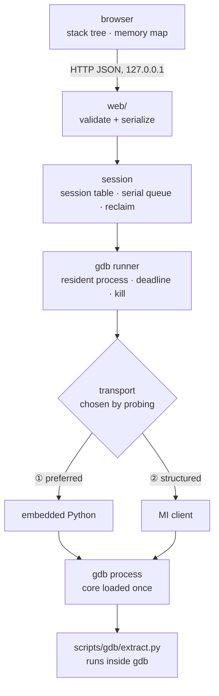
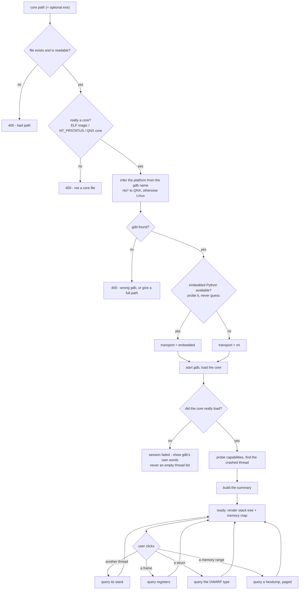

# Architecture

> The shape of the system and where the code goes.
> `requirements.md` says **what** to build and why; this file says **how it is put together**.
> `api.md` says what the HTTP layer answers, and which of these promises a test can hold it to.

---

## 1. The one decision that shapes everything

**One resident gdb process per session. Build a summary once; everything else on demand.**

- the `core` is loaded **once** per session (seconds to minutes), so every later query is milliseconds;
- at load time we build a **summary** = the one screen the user sees first:
  the thread list, the **crashed thread's stack**, and the memory map;
- everything else — other threads' stacks, registers, struct expansion, hexdumps — is queried
  **on demand** through that same resident process.

**Why not parse the whole core up front and write a file:**

- the bulk of a core **is** memory contents, so "parse it all" means turning a GB-scale file into
  another GB-scale file;
- the metadata that *could* be extracted up front is exactly what the summary already covers;
- at P0 we do not know what the user will click, so prefetching is guesswork in both directions
  (too little → we go back to gdb anyway; too much → wasted work and a longer first screen).

Exporting a **snapshot** (the summary plus whatever the user actually expanded) is a later, optional
feature — and it stores **data, never pre-rendered views**, or every UI change invalidates every
snapshot.

**Consequence:** this single choice is why the rest of this document exists. A resident process needs
serial command handling, timeouts, crash detection, idle reclaim and a clean shutdown; a one-shot batch
script needs none of those.

---

## 2. Layers



**Dependencies point downwards only.** Reverse or cross-layer imports are rejected:

- `schema.py` imports nothing else in the project — it is pure data plus the contract version;
- **`analysis/` never imports `web/`** — the processing logic must not know that HTTP exists;
- `web/` never touches gdb directly — it goes through `analysis/session`;
- **all gdb interaction lives in `analysis/gdb/`** (plus `scripts/gdb/extract.py`, which runs *inside* gdb);
- the frontend never touches the filesystem or gdb — it only consumes `/api/*` JSON.

### Transports — one class each, chosen by probing

**Platform is not an axis in the code.** Linux and QNX are just different `gdb` binaries; what matters is
what a given binary can actually do. So the transport layer is a small class hierarchy:

```text
Transport (abstract)      threads · backtrace · frame_arguments · frame_variables · registers ·
                          stack_frames · frame_slots · memory_map · libraries · read_memory ·
                          disassemble · evaluate · expand · symbolize · capabilities
├── EmbeddedTransport     ① a payload runs inside gdb (needs Python in that gdb build)
└── MiTransport           ② structured records over --interpreter=mi3/mi2/mi
```

**Status:** `MiTransport` is implemented and tested against a real aarch64 core — threads, backtrace,
frame arguments and locals, registers, `read_memory` (holes preserved), `disassemble` (C6), the typed walk
(`evaluate` / `expand`), the stack as memory (`stack_frames` / `frame_slots`), and the dump's shared objects
(`libraries`, which is gdb's answer to "which files did this core have" — including the ones it can name and
cannot place). `EmbeddedTransport` is
**deferred**: every gdb on the development machine is `--without-python`, so it could not be developed
against reality. The board's two gdbs *do* have Python, so it becomes testable there once the runner can
spawn gdb over ssh.

### Disassembly: what the transport may and may not ask (measured)

`-data-disassemble` has two forms and they answer different questions, which is the whole design of C6:

| form | what it gives | measured behaviour |
|---|---|---|
| `-a ADDRESS` | the enclosing **function**, named, every instruction offset from its start | refuses with `No function contains specified address` when there is none — the honest answer for a stripped address, and for data |
| `-s START -e END` | a window of bytes | answers for **anything reachable**, including data: the heap address `0x55ac5bf2a0` decodes as `udf #1` |

So the address form is the default, and the range form is used only with `allow_unsymbolized=True`, which
the caller may only pass after establishing from the core's own `PT_LOAD` permissions that the address is
code (`analysis/elf.py`). Modes: `0` instructions, `2` instructions with raw opcodes, `1`/`3` the same
grouped by source line (`src_and_asm_line` → `line`, `file`, `fullname`, `line_asm_insn`) — and a group with
**no** instructions is real (a declaration line compiles to nothing). DWARF is enough for the *line numbers*
and file names; the source **text** is the backend reading a file, and the paths point at the machine that
built the binary, so a substitution root is configuration (`set substitute-path /home/lyy/cdwv-practice
<checkout>`) rather than a guess. Note also that the documented `-a ADDRESS -c COUNT` is refused outright by
GDB 13.3 (`Unknown option 'c'`): the manual is not the measurement.

**And the licence is to try, not to believe.** Measured while filling a code window: the range form over the
practice plugin's whole 4 KB code page returned 1024 instructions, of which 178 of the 228 a screenful showed
were fabricated — `.inst 0x464c457f ; undefined` is `\x7fELF`, because the page begins with the ELF header.
"This address is in an executable mapping" says the *range* may be disassembled at all; filling a window with
code means finding the **functions** in it (the symbol table) and asking for each one, since the function
form refuses on data instead of inventing an instruction.
The interface above is the reservation; adding it later is one new file and one line in the probe list, and
**no empty stub is written in the meantime**.

#### The stack is memory, so it is parsed like memory

A backtrace says which functions were called; it does not say which bytes each of them owns, and that is
what a memory view needs. `stack_frames` adds the extent — `sp` of the frame to `sp` of its caller, both
*measured* — and decodes the frame record at the frame pointer (`[fp+0]` saved frame pointer, `[fp+8]`
return address on aarch64). `frame_slots` locates each local and argument with `&name` and gives it a size,
so a spilled variable can be drawn on the bytes it actually occupies.

Three rules keep this portable rather than Linux-shaped:

- **the frame record table is keyed by architecture, not by operating system.**
  QNX on aarch64 is AAPCS64 and QNX on x86_64 is SysV, so `FRAME_RECORDS` covers both platforms at once.
  What an OS changes is metadata — thread stacks, guard pages, the shape of a core note — and that is
  gdb's business, not ours;
- **a decoded record is verified against gdb before it is believed.** The saved frame pointer has to equal
  the *next frame's* `fp` and the return address the next frame's `pc`. A build without frame pointers, a
  signal frame, or a wrong table fails that check and gets no record field — never a chain that is not
  there. `verified: false` means "decoded, but nobody could corroborate it";
- **a variable only has a slot when gdb puts its address inside this frame.** A register-resident variable
  has no bytes in the dump and a `static` is not part of the frame; both keep their value and get no byte
  range. An unknown architecture costs the record fields and nothing else: `sp`/`fp`/extent still work.

**Nothing on a stack is reported as a blank.** A missing extent, an unreadable frame record and an
unverified one are three different answers, so each carries its reason in words (`extent_why`, and a
`record.why` that is present even when there is no record), and the two checks inside `verified` —
`saved_fp` and `return_address` — are reported separately, because they fail for different reasons: a frame
pointer that misses the next frame is a broken chain, while a return address that does not match is the
bytes themselves having been overwritten. A check that could not run is `None`, which is neither a pass nor
a failure.

That shape comes from measured samples, not from imagination: `practice/src/smash_target.c` produces three
cores — a smashed return address (gdb reports two unnamed frames and **no warning at all**, so the viewer
is the one who has to notice), a smashed frame pointer (DWARF CFI still unwinds correctly while the frame
record disagrees with the next frame), and a smashed local pointer (the stack verifies, and the answer is
the eight bytes of the local). Tests in `tests/gdb/test_mi_transport.py` pin all three.

**Below `sp` is evidence, not history.** A `ret` erases nothing, so the free stack still holds the records
of calls that returned (measured on the practice core: 16 KB of 123 KB, 79 saved frame pointers). Those
records may be verified one at a time with the same two checks — the pointer lands inside this stack and
above itself, the return address lands in an executable mapping — and then stated as facts. Reconstructing
a *previous call chain* is deliberately out of scope: a reused stack is ambiguous, so the chain would be a
hypothesis that reads like an answer (see `docs/requirements.md` §4.3).


- **the runner is shared**: spawning (with `--nx -q`), the command queue, deadlines, the reader threads
  and the kill escalation all live in `runner.py`; a transport only encodes one command and decodes one
  reply;
- **selection is a probe, not a guess**: the classes are tried in priority order (`embedded → mi → cli`)
  and the winner must pass a **smoke test on the real core** — "the transport exists" and "the transport
  can serve this dump" are different claims;
- **capabilities are measured per command, not per transport**: this matters most for MI, where a vendor
  fork may implement only part of the record set. Whatever fails is reported unsupported and the UI hides
  it;
- **an unsupported op raises, it never returns empty data**: the API turns it into 501 and the frontend
  disables that entry point;
- **CLI text parsing is documented but not built** (spec §7 C). **Do not write an empty stub for it**: a
  class that only raises `NotImplementedError` is dead code that rots, and it makes people believe CLI is
  supported. The *interface* is the reservation — adding it later means writing `cli.py` and appending one
  entry to the probe list, with nothing else to touch.

---

## 3. Load and recognition



Four gates, and two of them are the ones that bite:

1. **path** — exists and is readable;
2. **format** — it really is a core;
3. **tool** — gdb exists, and we **probe** whether it has embedded Python instead of guessing from its
   name (the same `nto*-gdb` ships with different Python support across versions);
4. **did the core actually load** — "gdb started" is *not* "core is loaded". This gate asks gdb for the
   answer and turns a failure into a **failed session with gdb's own words**, never into an empty
   thread list. That is the most expensive lesson in this project.

---

## 4. Summary vs on demand

| data | when | where it goes |
|---|---|---|
| thread list, crashed thread, per-thread frame counts | load (once) | summary → first screen |
| crashed thread's stack | load (once) | summary → stack flow graph, crash frame at the end |
| **frame arguments** (`with_arguments`) | with the stack (one query per stack, not per frame) | each flow node says what its call was given |
| **frame locals** (`frame_variables`) | on demand, **one frame per click** | the crash frame's own variables — usually where the cause is |
| **stack extent and frame records** (`stack_frames`) | on demand, for the frames in view | the stack window, as memory a frame owns |
| **stack slots** (`frame_slots`) | on demand, one frame per click | which bytes of the stack window each variable occupies |
| **code** (disassemble) | on demand, **one window per scroll**, cached by range | the instructions beside the bytes on screen |
| memory map (segments: range, permissions, size, source file) | load (once) | summary → memory view |
| **the dump's shared objects** (`libraries`) | load (once), **one command** | the *second* naming source for the map: a region is named from it when the core's own `NT_FILE` note named nothing (`docs/api.md` §3.1a) |
| **identifying a mapping by its content** | on demand, **one click**, and **0 gdb commands** | which file an anonymous mapping's bytes came from — an inference, and the only one (`docs/api.md` §3.3) |
| capabilities (what this dump can and cannot show) | load (once) | drives which panels are shown/disabled |
| another thread's stack | on demand | stack flow graph |
| registers of a frame | on demand | frame detail |
| struct expansion (DWARF) | on demand | object view; absent when the dump has no DWARF, and said so |
| memory hexdump | on demand | memory view, paged |
| navigate: a value → the memory it points at | on demand | memory view, positioned there |
| navigate: an address → the function / segment / thread stack it belongs to | on demand | a navigation target |
| typed expansion (`expand`) | on demand, **one level per click** | structure tree |
| lock/object relationships | not now (see the spec §4.3) | — |

On-demand results are **cached per session**: asking for the same thread's stack twice must not send a
second command to gdb.

### The navigation model (C4 / C5)

Every value the UI renders is a link, and **every link is one deterministic step**:

| from | action | to |
|---|---|---|
| register / argument / local | treat the value as an address | the memory view, positioned there |
| a memory cell or range | ask what it belongs to | a function, a segment, or the thread whose stack contains it |
| a memory range | interpret it as a type | a structure tree |
| a struct field | follow it | its own memory (scalar) or its pointee (pointer) |

**One step per click is what makes "back" meaningful**: following a pointer field moves exactly one level,
so back returns exactly one level. Multi-level pointer chains need no extra machinery — they are that same
step, repeated.

**A step is one selection with three visible effects.** A jump that only moved the bytes would leave the
reader looking at a new place with the old place still selected — which is what happened: clicking a saved
register in a frame jumped the hex view to the target, while the hex highlight and the right-hand structure
stayed where they were. So every step, from every surface, does all three:

| what moves | what it means |
|---|---|
| the **bytes** | the pane scrolls so the target is on screen, and the target becomes the current address |
| the **source** | what was clicked is marked as selected: the field row, the instruction chip, the rail line |
| the **structure** | the rail re-roots on what lives at the target — a frame, a struct, a code page — instead of staying on the previous root |

This is one rule, not four. The four surfaces it must hold for are the ones with a value that points somewhere:
**a stack frame's field, a struct's field, a pointer in a typed tree, and a target in the code listing.** Each
adds its own way of finding the target; none of them decides on its own whether the other two panes follow.

**Inside a line, the address and the line are two different clicks.** An instruction row carries both, and they
must not be collapsed into one handler: the **address** is the address logic — go where it points, and mark what
is *there* (its bytes and the instruction that lives at it) — while the **rest of the row** is the line logic:
mark *this* instruction and do not move. Conflating them marked the `b.eq` when the reader had clicked the
address it branches to, which reads as "it highlighted the wrong line".

Rules that keep a deep chain from turning into a hang:

- **cycles are detected, not followed**: the traversal remembers the addresses on the current path, and a
  repeat is rendered as a link back to the node already on the path — never expanded again;
- **`NULL`** renders as `NULL` and is not clickable;
- **"no bytes" and "no mapping" are different answers**, and conflating them is how a viewer lies:
  an address in **no mapping at all** is reported as "not in this dump" — a **normal result**, not an error
  and not a crash; an address that **is mapped, but whose page the core does not carry**, is reported as
  exactly that, naming the object it belongs to. A clean **file-backed** page is usually missing from the
  core *and still readable* — gdb takes its bytes from the `.so` itself — so it must never be shown as
  "not in this dump";
- **lazy, with limits**: one structure level per click, arrays and linked lists paged (first N, then "load
  more"), and a hard depth cap, so a runaway chain cannot cost unbounded gdb round trips;
- **cached per session** by `(address, type)`;
- **`void *`, unions and stripped types cannot be expanded automatically**: show the raw bytes plus an
  "interpret as…" picker. Guessing a type is worse than showing memory.

**Agent ops this needs** (fixed and structured — never arbitrary gdb expression evaluation):
`read_memory(addr, len)` (what the hex view paints, holes included) · `evaluate(expression)` →
`{type, value}` · `expand(expression)` → one level of `{field, type, value, num_children}` children ·
`symbolize(addr)` (which object is this address in) · `disassemble(address, source=?, opcodes=?)` → the
function's instructions plus, when asked, the source lines they compiled to (C6).

**Expressions are composed by us, not by the user.** A child arrives as a field name (`next`) plus the
type of its parent, so the next expression is `parent->next` for a pointer parent and `parent.next`
otherwise. There is no arbitrary-expression entry point: the walk is always one structured step from
something already on screen.

**All of C5 depends on DWARF — in the dump, not in the transport.** MI carries typed expansion perfectly
well: the cross gdb used here is `--without-python` and still walks `struct node` field by field. What kills
C5 is a binary with no debug information. That is measured like every other capability (a probe on the real
core), and the UI disables the typed entry points instead of offering a control that cannot work.

---

## 5. Code layout

This is the **target layout** — the files the project is meant to end up with. There are no
"already done" marks: the v1 prototype was removed in full, so everything below is to be written.
The order in which it gets built is the roadmap in `requirements.md` §10.

```text
coredump-web-viewer/
├── main.py                      the only entry point: python main.py
├── conftest.py                  puts src/ on sys.path for the test suite
├── requirements.txt             backend dependencies
├── AGENTS.md                    index
├── docs/
│   ├── requirements.md          the specification
│   └── architecture.md          this file
├── src/                         ← all backend code
│   ├── version.py               __version__
│   ├── config.py                port / deadlines / limits / gdb path (env-overridable)
│   ├── schema.py                the JSON contract, shared by web/ and analysis/
│   ├── web/                     ← the backend HTTP layer (not the frontend — that is `ui/`)
│   │   ├── __init__.py
│   │   ├── app.py               FastAPI instance + static hosting
│   │   ├── routes.py            /api/* routes (thin: validate + serialize only)
│   │   └── errors.py            exception → HTTP status + error body
│   └── analysis/                ← the processing logic (nothing HTTP-aware in here)
│       ├── __init__.py
│       ├── session.py           session table, serial queue, idle reclaim
│       ├── elf.py               pyelftools: PT_LOAD + the NT_FILE note
│       └── gdb/                 ← every gdb interaction, and nowhere else
│           ├── __init__.py
│           ├── base.py          abstract Transport + Capabilities + Unsupported
│           ├── runner.py        resident process: spawn, reader threads, sentinel parse,
│           │                       deadline, kill escalation (shared by all transports)
│           ├── embedded.py      ① payload transport (needs Python inside gdb)
│           ├── mi.py            ② MI transport + record parsing
│           └── probe.py         picks a transport: priority order + a smoke test on the core
├── tests/
│   ├── test_smoke.py            contract, sentinel round-trip, platform inference
│   └── test_api.py              HTTP behaviour (400/404/501/…)
├── ui/                          ← the FRONTEND (static files, served by the backend; no build step)
│   ├── index.html               page shell
│   ├── app.js                   plain JS; ES modules as the views grow
│   ├── styles.css               the pane chrome, the code rail, the overlay column
│   └── data/                    generated sample datasets — not source, rebuilt by the script below
└── scripts/                     ← gdb-facing scripts only; nothing unrelated goes here
    ├── gdb/
    │   └── extract.py           the payload that runs inside gdb → the resident agent (request/reply loop)
    ├── dump-fixture.py          drives the transport against a practice core and writes ui/data/
    └── check-gdb-python.sh      probe whether a gdb has embedded Python (run from a shell)
```

The spec (`requirements.md` §8) names logical modules; here is where each one lands:
`session` → `analysis/session.py` · `transport` → `analysis/gdb/base.py`, implemented by
`analysis/gdb/embedded.py` / `mi.py` · `gdb_runner` → `analysis/gdb/runner.py` ·
`embedded_transport` → `scripts/gdb/extract.py` + `analysis/gdb/embedded.py` · `mi_transport` →
`analysis/gdb/mi.py` · `transport_probe` →
`analysis/gdb/probe.py` · `elf_parse` → `analysis/elf.py` · `schema` → `schema.py` · `api` → `web/` ·
`viz` → `ui/` (the frontend folder at the repository root).

**Three rules keep this flat and obvious:**

- `main.py` and `conftest.py` put `src/` on `sys.path`, so imports are plain module paths —
  `from web.routes import router`, `from analysis.session import SessionManager`,
  `from analysis.gdb.runner import GdbRunner`, `from schema import …`. No package name to invent, and no
  `--app-dir`-style flag.
- **the two layers never reach back**: `web/` may import `analysis/` and `schema`; **`analysis/` must
  never import `web/`** — the processing logic must not know that HTTP exists at all.
- the FastAPI instance lives in `src/web/app.py`, **not** in a second file called `main.py`. The root
  `main.py` is the entry point (put `src/` on the path, parse args, start uvicorn). Two files named
  `main.py` was exactly the confusion the old `server/app` layout produced.

> **Why the frontend is not inside `src/`.** `src/` is the Python import root: it goes on `sys.path`,
> so everything in it is treated as importable code. The frontend is static HTML/JS that is only ever
> *served*, never imported — so it lives in `ui/` at the repository root. That keeps the two lifecycles
> apart (edit and refresh vs. restart), keeps lint/compile out of the markup, and avoids a second folder
> called `web` next to the backend's `src/web/` HTTP layer.

**Everything in this tree is to be written.** There is no skeleton to move — the v1 prototype was
removed in full.

---

## 6. Concurrency and lifetime

Necessary consequences of §1, not optional polish:

| rule | why |
|---|---|
| **one command in flight per session** (a lock plus a queue) | a single gdb drives one inferior and one command stream |
| **every command has a deadline**; on deadline, kill the gdb process and fail the session | a hung gdb cannot be trusted, and there is nothing to resynchronise |
| **a reader thread watches for EOF** | gdb dying must fail every queued command immediately instead of hanging forever |
| **idle sessions are reclaimed** | a resident process costs memory for as long as it lives |
| **shutdown kills every child gdb process** | otherwise the user closes the app and leaves zombie processes behind |
| **the core is loaded once per session** | the whole point of §1 |
| **session capacity is 1, and that is a policy** | a local tool loads one core at a time; every endpoint is still id-addressed, so raising the cap later is a config change, not a rewrite |

Loading is **asynchronous**: creating a session returns immediately, and the first screen fills in as
soon as the summary exists. A core takes seconds to minutes, so the user must see progress (gdb's own
`Reading symbols from ...` line is the progress text) and must be able to cancel.

---

## 7. Configuration

Everything tunable lives in `config.py`, overridable by environment variables:

| setting | default | meaning |
|---|---|---|
| `host` / `port` | `127.0.0.1:8000` | local only, by design |
| `gdb_path` | `gdb` | overridden per session for QNX (`nto*-gdb`) |
| probe deadline | 20 s | the embedded-Python probe |
| load deadline | 180 s | spawn → core loaded → capabilities |
| command deadline | 30 s | one query round trip |
| idle reclaim | 30 min | a session with no queries |
| shutdown grace | 5 s | `terminate()` then `kill()` |
| default `limit` / ceiling | 256 / 4096 | paged responses (`backtrace`, hexdump) |
| expansion depth cap | 32 | following pointer fields; deeper chains must be re-entered deliberately |
| list / array page size | 64 | linked lists and arrays expand in pages, not all at once |
| `max_sessions` | 1 | the capacity policy of §6 |

---

## 8. Deliberately not in this architecture

- **no frontend build step** — plain HTML/JS served by the backend (a bundler can come later without
  touching the backend);
- **no multi-session scheduling** — capacity is a policy (§6), the interface is already id-addressed;
- **no kernel dumps, no live debugging, no auth** — out of scope in the spec;
- **no pre-rendered artifacts** — the API returns data; rendering belongs to the browser.
